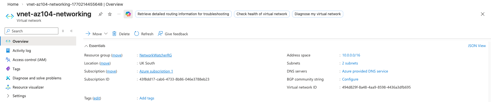
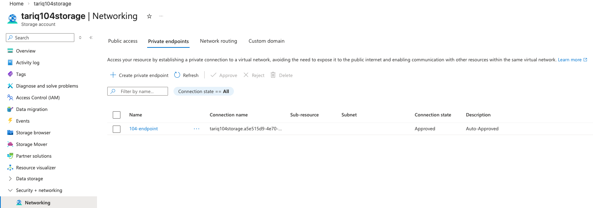
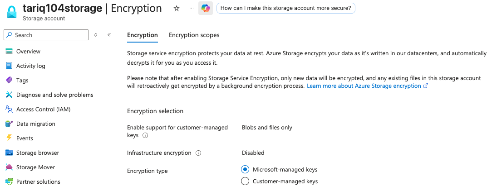
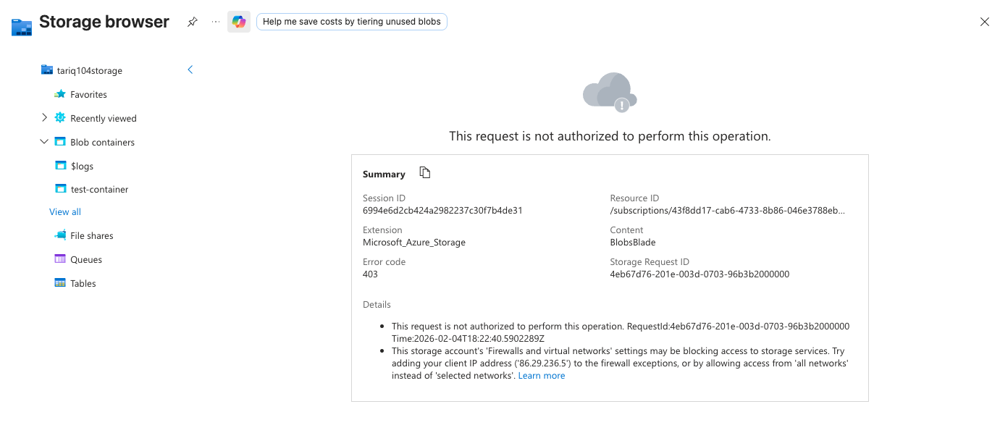
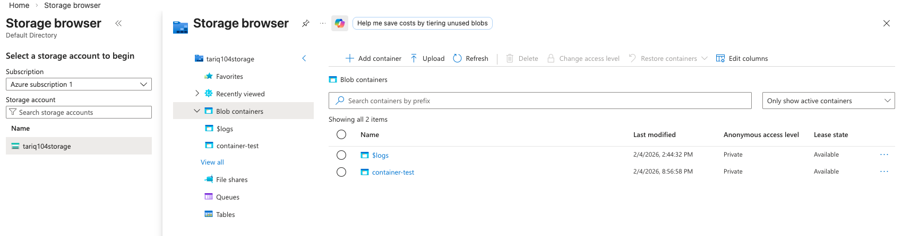
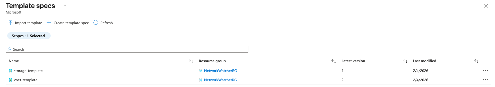

# 🚀 Project 2 – Azure Networking & Secure Storage (AZ-104)

## 📌 Overview  
This project demonstrates how to design a secure Azure network architecture, protect resources using Network Security Groups (NSGs), deploy a private Storage Account with encryption and private endpoints, and automate deployments using ARM Template Specs. It also validates security controls by testing both allowed and denied network access paths.

---

## 🎯 Objectives  
- Design a Virtual Network (VNet) with isolated subnets  
- Secure inbound traffic using Network Security Groups (NSGs)  
- Deploy a Storage Account with **private endpoint only (no public access)**  
- Enforce **encryption at rest**  
- Automate deployments using **ARM Template Specs**  
- Validate security by testing allowed vs denied access  

---

## 🧱 Architecture  

**VNet Address Space:** `10.0.0.0/16`  

**Subnets:**  
- `Web` → `10.0.1.0/27`  
- `Database` → `10.0.0.0/27`  

**Security Design:**  
- NSG attached to Web subnet  
- HTTPS (443) allowed from Internet  
- All other inbound traffic denied  
- Storage Account accessible only via Private Endpoint  
- Public access disabled  
- Microsoft-managed encryption enabled  

---

## 🛠️ Implementation

### 1️⃣ Virtual Network & Subnets  
Created a VNet with isolated Web and Database subnets.

---

### 2️⃣ Network Security Group (NSG)  
Created `nsg-web` and associated it with the Web subnet.  
Configured inbound rules to allow only HTTPS traffic from the internet.

---

### 3️⃣ Secure Storage Account  
Configured the storage account with:  
- Public network access **disabled**  
- Private Endpoint attached to Database subnet  
- Microsoft-managed encryption enabled  

  

---

### 4️⃣ Access Control Validation (Blocked Access Test)  
Attempting to access the storage account from the public internet is blocked by firewall rules.

---

### 5️⃣ Authorized Access Test  
Verified access is allowed when accessed via approved network paths.

---

### 6️⃣ ARM Template Automation  
Exported templates and deployed them using Azure Template Specs.

---

## 🔐 Security Summary  

| Control                    | Status |
|----------------------------|--------|
| NSG Inbound Filtering      | ✅ Enabled |
| Public Storage Access      | ❌ Disabled |
| Private Endpoint           | ✅ Enabled |
| Encryption at Rest         | ✅ Enabled |
| Network Segmentation       | ✅ VNet + Subnets |
| Infrastructure as Code     | ✅ ARM Templates |

---

## 🧠 Key Learnings  
- How NSGs control traffic at subnet level  
- How private endpoints remove public exposure  
- How to secure storage accounts using network isolation  
- How ARM templates help with repeatable deployments  
- How to validate security using access testing  

---

## 🧹 Cleanup (Avoid Charges)
After completing the lab, delete the following resources:

- Virtual Network  
- Network Security Group  
- Storage Account  
- Private Endpoint  
- Template Specs  
- Resource Group  

---

## 📎 Skills Demonstrated  
Azure Networking • NSGs • Private Endpoints • Secure Storage • ARM Templates • AZ-104 Skills
